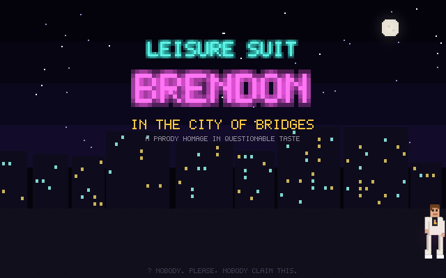
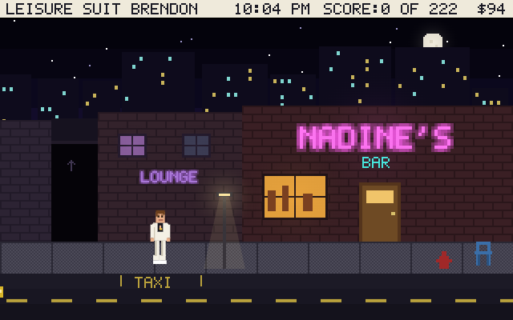
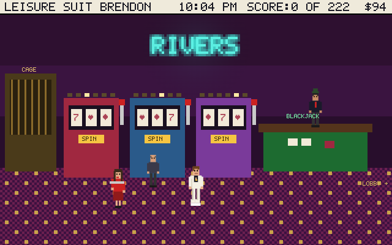
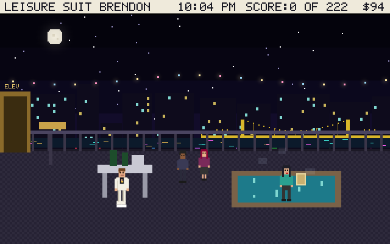
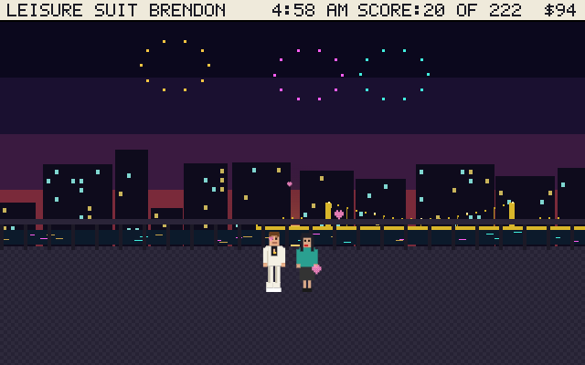

# Leisure Suit Brendon 🕺

**► [PLAY IT IN YOUR BROWSER](https://sbmarketinginc.github.io/leisure-suit-brendon/)**

An original parody homage to the classic 1987 Sierra adventure — set in **Pittsburgh**.
It's 10 PM on the South Side. Brendon — 38, creative genius (self-described), one white
leisure suit, $94, breath like ambition — has until sunrise to find true love in the
City of Bridges.



## The night ahead

Talk your way through **Nadine's Bar** on East Carson, decode the bathroom graffiti,
out-shop Big Sal with a porcelain owl, dumpster-dive behind the bar, survive the
**Get-N-Go** intercom, dance your heart out at **Disco Inferno**, get married (briefly),
get robbed (thoroughly), rebuild your fortune at the **Rivers Casino**, and make it to a
rooftop jacuzzi before dawn.

| | |
|---|---|
|  |  |
|  |  |

## Features

- 14 hand-drawn EGA-style scenes, all rendered in canvas — zero dependencies, one HTML file
- Point-and-click verbs **and** a classic text parser (`give whiskey to drunk`, `wiggle`…)
- Playable **blackjack**, **slots**, and a **dance-off** minigame
- Comedic deaths with instant rewind, a HINT button, auto-save
- Original WebAudio lounge/disco soundtrack
- Max score: **exactly 222 points**, as tradition demands
- Yinzer cab banter, a parking chair you must not touch, and one philosophical alley cat

## Play locally

Open `dist/index.html` in any browser. That's it.

## Build from source

```
./build.sh   # concatenates src/ into dist/ and docs/
```

---

*An original parody. All art, writing, music, and code are new. Not affiliated with Sierra
On-Line, the Leisure Suit Larry franchise, Nadine's, or the Rivers Casino — made with
affection for all of them.*
